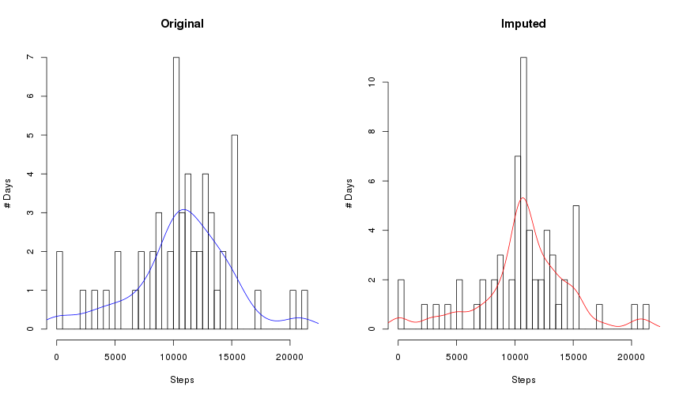
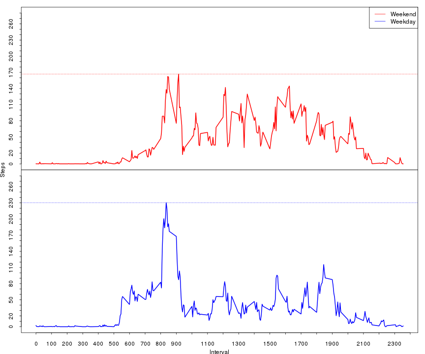

Reproducible Research: Peer Assessment 1
========================================
coursera.org - repdata-005
Brendan Swiniarski - August 2014

## Data
I will be using the 'activity.csv' unzipped from the original zip file provided
    in the [git repository][assignment_repository]that we forked for this
    assignment, and made available from the hosted file
    [linked in the assignment's instructions][hosted_dataset].
    
This dataset contains self-reported activity in number of steps per 5-minute
    interval throughout each day, from 2012-10-01 through 2012-11-30.  
    
This dataset follows the following scheme:  

* __steps__: Number of steps, missing values coded as `NA`.
* __date__: The date on which the observation was reported
            in YYYY-MM-DD format.
* __interval__: Identifier for the 5-minute interval, starting at `0` and
                going through `2355` each day.  
    * *NB*: This format is very confusing. think of it as format like
        __HH:MM__, but with leading zeros removed. We will be cleaning this up
        before we use it in time series charts, but even without preprocessing
        it into a `POSIXct` format it can be useful as an ordinal numbering system.
                
## Loading and preprocessing the data
To begin with, we will need the dataset, available at the
    [link mentioned above][hosted_dataset].  
We need to be OS-conscious here, the internal methods for UNIX-based systems
__do no support https__, so in that case we need to use the `rcurl` package.


```r
# This code chunk will download the zip file into the working directory.
if (.Platform$OS.type == 'unix') {
    download.file('https://d396qusza40orc.cloudfront.net/repdata%2Fdata%2Factivity.zip',
                  'repdata_data_activity.zip', method='curl')
} else {
    download.file('https://d396qusza40orc.cloudfront.net/repdata%2Fdata%2Factivity.zip',
                  'repdata_data_activity.zip')
}
```

Next we unzip the file and get our csv:  

```r
unzip('repdata_data_activity.zip', 'activity.csv')
```

#### Reading and Preprocessing the dataset
There isn't much preprocessing to do at first. We will have some processing to
    do in later sections, however for now we can use the dataset as-is if we
    read it correctly. I will be using the `data.table` library, as it is faster
    and more memory efficient.  
    
I am going to coerce `fread()` to read the steps as a `double` numeric value
    rather than as an `integer`, because it saves us from having to do it later
    when we look at fixing missing values, and does not affect any of our'
    other usage throughout this process.

```r
library(data.table)
activity <- fread('activity.csv', colClasses=c('double', 'characater', 'integer'))
```

From this function, we now have a `data.table`, let's see what it looks like.
    Notice we have __many__ `NA`'s - we will be fixing that later on.

```r
activity
```

```
##        steps       date interval
##     1:    NA 2012-10-01        0
##     2:    NA 2012-10-01        5
##     3:    NA 2012-10-01       10
##     4:    NA 2012-10-01       15
##     5:    NA 2012-10-01       20
##    ---                          
## 17564:    NA 2012-11-30     2335
## 17565:    NA 2012-11-30     2340
## 17566:    NA 2012-11-30     2345
## 17567:    NA 2012-11-30     2350
## 17568:    NA 2012-11-30     2355
```

## What is mean total number of steps taken per day?  
First, let's see what a histogram of the total number of steps taken each day
    looks like. __NOTE__: I'm not including observations that have `NA` values
    for steps. This gives us a very high frequency for the `0` bar in
    our histogram.

```r
sum.steps.by.day <- activity[!is.na(steps),sum(steps, na.rm=TRUE), by=date]
hist(sum.steps.by.day$V1, breaks=length(sum.steps.by.day$V1),
     xlab='Total Steps', ylab='# of days',
     main='Frequency of Total Steps per Day')
```

 

Now, for statistics' sake, let's find the mean and median:

```r
mean(sum.steps.by.day$V1)
```

```
## [1] 10766
```

```r
median(sum.steps.by.day$V1)
```

```
## [1] 10765
```

Later, I'll be comparing these values to the same statistics after having
    "fixed" `NA` values in the dataset.  


## What is the average daily activity pattern?  
#### What else can this dataset tell us?  
Let's look at the steps taken over the course of an average day:  

```r
average.day.by.interval <- activity[,mean(steps, na.rm=TRUE), by=interval]
plot(average.day.by.interval$V1 ~ average.day.by.interval$interval, type='l',
     xlab='Interval (increments of 5 minutes)', ylab='Average # Steps',
     main='Average Daily Activity')
```

 

So when is this dataset *most* active on average?

```r
average.day.by.interval[order(-V1)]
```

```
##      interval    V1
##   1:      835 206.2
##   2:      840 195.9
##   3:      850 183.4
##   4:      845 179.6
##   5:      830 177.3
##  ---               
## 284:      350   0.0
## 285:      355   0.0
## 286:      415   0.0
## 287:      500   0.0
## 288:     2310   0.0
```

This individual is clearly a morning person: 8:35 AM is, on average,
    the most active interval, with the rest of that time period from 8:30 to 
    8:50 taking up the top 5 most active intervals on average.

## Imputing missing values  
Now let's take a look at our dataset's missing values.

```r
na.values <- activity[,c(sum(is.na(steps)), sum(!is.na(steps)))]
na.values
```

```
## [1]  2304 15264
```
Here we can clearly see we have __2304__ `NA` values and
    __15264__ observations with usable data.  

So how can we impute these values? The best approach is one that doesn't
    inherently skew our baseline statistics. What I'm going to do is use our 
    data for the average of each interval, and replace `NA` values with that.
    At worst, this will skew our results very slightly towards a pre-existing
    central tendency.


```r
# First we'll give our average.day.by.interval table some better column names
setnames(average.day.by.interval, c('i', 's'))

# Next, we'll copy our data table into a new object
imputed.activity <- data.table(activity[,])

# Then, since we need to go through this by row, we'll add a column that is akin
# to row numbers in a data frame. We'll be removing this later.

# .N is a special integer variable in data.table objects that is the count of
# all rows returned in this 'by', since we have no 'by' it counts all rows in
# the data.table
imputed.activity[,r:=1:.N]

# Using 'by=r' to go through each row, we will substitue the averages for NA
# values in our data.table
imputed.activity[,steps:={
    if (is.na(steps)) {
        average.day.by.interval[i==interval,s]
    } else {
        steps
    }
}, by=r]
```

Now let's do some of the same plotting and calculations on our newly imputed
    data set and see if there are any major differences:

```r
imputed.sum.steps.by.day <- imputed.activity[,sum(steps, na.rm=TRUE), by=date]
hist(imputed.sum.steps.by.day$V1, breaks=length(imputed.sum.steps.by.day$V1),
     xlab='Total Steps', ylab='# of days',
     main='Frequency of Total Steps per Day, imputed dataset')
```

 

```r
mean(imputed.sum.steps.by.day$V1)
```

```
## [1] 10766
```

```r
median(imputed.sum.steps.by.day$V1)
```

```
## [1] 10766
```

As we can see, the means of our two datasets are identical, and the median is
    only different by 1 step, which amounts to
    0.0093% - completely negligible.
    
As for our histograms, let's make it really clear how they've changed. First 
    we will create two histograms, and overlay a density line on each.

```r
#Plot a histogram of our original dataset, then plot a density line
sum.hist <- hist(sum.steps.by.day$V1, breaks=length(sum.steps.by.day$V1))
# we are using this multiplier to overlay the density line on our
# frequency histogram, otherwise the density line is in the range of 1e-6
multiplier <- sum.hist$counts/sum.hist$density
sum.density <- density(sum.steps.by.day$V1)
sum.density$y <- sum.density$y * multiplier[1]

#Same process for our imputed dataset
imputed.sum.hist <- hist(imputed.sum.steps.by.day$V1,
                         breaks=length(imputed.sum.steps.by.day$V1))
imputed.multiplier <- imputed.sum.hist$counts/imputed.sum.hist$density
imputed.sum.density <- density(imputed.sum.steps.by.day$V1)
imputed.sum.density$y <- imputed.sum.density$y * imputed.multiplier[1]
```

Now let's see what they look like side-by-side:

```r
#plot these next to each other.
par(mfrow=c(1,2))

plot(sum.hist, main='Original', xlab='Steps', ylab='# Days')
lines(sum.density, col='blue')

plot(imputed.sum.hist, main='Imputed', xlab='Steps', ylab='# Days')
lines(imputed.sum.density, col='red')
```



This side-by-side comparison makes it clear that the way we imputed the data
    has narrowed the variance in our original curve, skewing it towards it's
    original mean.

## Are there differences in activity patterns between weekdays and weekends?  
To see what differences we have in the weekday activity versus the weekend 
    activity, first we'll need to decide which observations came from weekdays,
    and which came from weekends.
    

```r
# We will be using str_pad from the stringr library to format the intervals
library(stringr)
# next we will process our imputed data, creating our column that shows us
# weekday versus weekend.
imputed.activity[,is.wday:={
    # turn '0' into '0000', and '345' into '0345' etc.
    t <- str_pad(interval, 4, pad='0')
    
    # format our newly padded interval into an ISO time stamp
    t <- paste(substr(t,0,2), substr(t,3,4), '00', sep=':')
    
    # turn our date and new time stamp into a POSIXlt object
    t <- strptime(paste(date, t, sep=' '), '%F %T', tz='GMT')
    
    # determine if it's a weekday or weekend
    if (t$wday != 0 & t$wday != 6) {
        'weekday'
    } else {
        'weekend'
    }
}, by=r]
```


```r
# transform our new column into a factor
imputed.activity[,is.wday:=as.factor(is.wday)]
```

```
##          steps       date interval     r is.wday
##     1: 1.71698 2012-10-01        0     1 weekday
##     2: 0.33962 2012-10-01        5     2 weekday
##     3: 0.13208 2012-10-01       10     3 weekday
##     4: 0.15094 2012-10-01       15     4 weekday
##     5: 0.07547 2012-10-01       20     5 weekday
##    ---                                          
## 17564: 4.69811 2012-11-30     2335 17564 weekday
## 17565: 3.30189 2012-11-30     2340 17565 weekday
## 17566: 0.64151 2012-11-30     2345 17566 weekday
## 17567: 0.22642 2012-11-30     2350 17567 weekday
## 17568: 1.07547 2012-11-30     2355 17568 weekday
```


Now let's see what this data really looks like in a visual way:  

```r
# Set up our plotting parameters
par(mfrow=c(2,1), mar=c(0,0,0,0), oma=c(3,3,1,1), tcl='-.25')

# Weekend line
plot(imputed.activity[is.wday=='weekend',mean(steps), by=interval], type='l',
     axes=FALSE, col='red', lwd=2, ylim=c(0,280))
# Draw a y-axis for this plot
axis(2, at=seq(0,280,10))
# Frame this plot
box()
# Add a legend for our whole plot
legend('topright', lwd=1, col=c('red', 'blue'),legend=c('Weekend', 'Weekday'))

#Weekday line
plot(imputed.activity[is.wday=='weekday',mean(steps), by=interval], type='l',
     axes=FALSE, col='blue', lwd=2, ylim=c(0,280))
# Add a y-axis
axis(2, at=seq(0,280,10))
# Add an x-axis for the whole plot
axis(1, at=seq(0,2455,100))
# frame the Weekday plot
box()

# Label our plot axes
mtext('Interval', side=1, outer=TRUE, line=2.2)
mtext('Steps', side=2, outer=TRUE, line=2.2)
```



Generally speaking, it looks like __time of day__ doesn't have a huge effect on
    the observations, as tehy both have a similar overall shape, however we can
    clearly see there are simply __more steps__ on a Weekday than on the
    Weekend.
    
    

   [assignment_repository]: https://github.com/rdpeng/RepData_PeerAssessment1
   [hosted_dataset]: https://d396qusza40orc.cloudfront.net/repdata%2Fdata%2Factivity.zip
